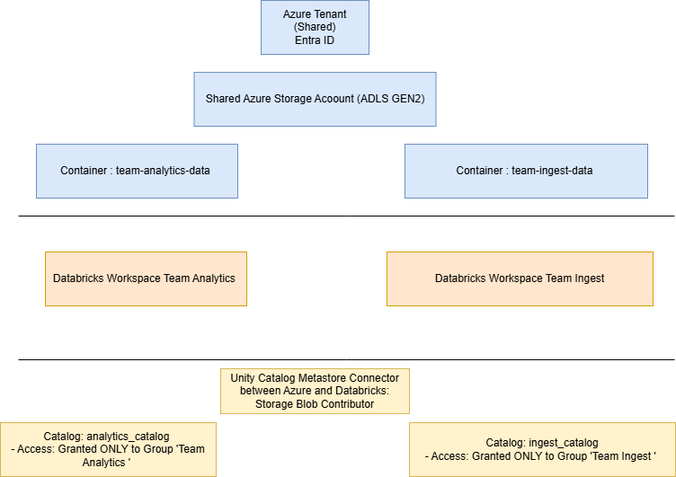

# Access Separation for multiple teams: The What, How and Why



## Goal

This project is based on a real devops task I was responsible for where I had to find a solution to add multiple teams and make sure each team had access only to their own data, permissions levels needed to be configured and the infrastructure for it to be built from scratch.

## Storage and Infrastructure level

Within Azure, there is a central Storage Account (ADLS Gen2) that contains 2 isolated containers per team: cnt-mad-analytics-dev and cnt-mad-ingest-dev.

## Enterprise Production & Operational Considerations

While this architecture serves as a verified local pseudo-Terraform baseline and for demo purposes of my devops skills, a live production deployment at the client repository central MAD platform would incorporate the following enterprise-grade standards:

### 1. VNets & Private Endpoints

- Databricks workspaces would be deployed using secure Virtual Network (VNet) injection. This separates compute cluster resources into private subnets and public subnets managed via corporate Network Security Groups (NSGs).
- Direct public internet routing to the ADLS Gen2 Storage Account is disabled. All control-plane and data-plane traffic is routed through private endpoints and private DNS zones over an Azure ExpressRoute backbone network.

### 2. Operational Secret Governance (Azure Key Vault)

- Critical credentials, system application paths, and database tokens are never stored in plain text or state files. They are stored inside Azure Key Vault (AKV).
- Workspaces leverage AKV-backed secret scopes. This allows notebooks to reference keys using securely permissioned `dbutils.secrets.get()` tokens natively at runtime without exposure risk.

### 3. Identity Governance Infrastructure

- The `azurerm_databricks_access_connector` utilizes System-Assigned Managed Identities. This eliminates the operational overhead of rotatable service principal client secrets, satisfying corporate compliance audits.

## Databricks Workspace level

Each team has its own Azure Databricks Workspace.

At the top level, there is a single Shared Microsoft Entra ID Tenant, which is standard enterprise practice for central identity management. However, to enforce strict team isolation, I created dedicated Entra ID Security Groups per team, one for Team Analytics and one for Team Ingest.
Microsoft Entra ID (Azure AD) Groups are created per team: grp-mad-analytics and grp-mad-ingest.

Team members are assigned ONLY to their team’s workspace. Team Analytics members cannot log into the Ingest workspace, completely isolating notebooks, workflows, and job runs.

Two key enforcements:

1. Workspace Level: Only members of grp-mad-analytics can log into the Analytics Databricks Workspace.

2. Unity Catalog Level: We assign data permissions explicitly to the groups. analytics_catalog grants access only to grp-mad-analytics, ensuring full data and code separation even though they share the underlying tenant and cloud subscription.

## Unity Catalog Governance Code Implementation

A single, centralized Unity Catalog Metastore governs data assets. Each team owns a dedicated Catalog (analytics_catalog, ingest_catalog).

Unity Catalog explicit GRANT statements enforce data boundaries:

  'GRANT USE CATALOG, CREATE SCHEMA ON CATALOG analytics_catalog TO grp-mad-analytics'

Thus, Members of grp-mad-ingest have zero permissions on analytics_catalog.

To see how would this be handled in code, head to unity_catalog_governance.tf located at the root folder.

*Explanation:*
Since I am running an offline pseudo-terraform setup, I intentionally separated Cloud Infrastructure Provisioning from Data Governance Orchestration. The Terraform module we are looking at handles the Azure cloud control plane (building the workspace and storage). However, Unity Catalog resources like Catalogs, Schemas, and SQL GRANT statements cannot be built until the Databricks workspace is fully online and accessible (See HowToRunTerraform.md Notes). In a production-grade environment like MAD, we handle Unity Catalog in one of two ways: either via a Secondary Databricks Terraform Provider Pipeline targeted directly at the workspace URL, or natively via Databricks SQL / Notebook setup scripts once the workspace initializes.

## Reusable Terraform Child Module: How easy it would be to add a third team later by reusing the same module?

The goal is to build a reusable Terraform Module locally executable (terraform plan ready):

reusable module name: 'modules/team_slice'

Team Ingest gets a workspace named dbw-mad-ingest-dev and a private, isolated storage container named cnt-mad-ingest-dev.

Team Analytics gets a workspace named dbw-mad-analytics-dev and a private, isolated storage container named cnt-mad-analytics-dev.

Through the child module's design, each team's unique Azure Databricks Access Connector is granted access strictly to its respective container.

The layout ensures they remain completely separate data boundaries inside the same storage account.

*Multi-Team Extensibility Architecture:*
Rather than duplicating brittle resource structures, the root core `main.tf` acts as a centralized automation engine.

- It utilizes a declarative metadata loop (`for_each = local.onboarded_teams`) to dynamically provision isolated environments, it is more production-grade and scalable pattern than duplicating module blocks manually.

- Adding a 3rd or 4th team in the future requires adding exactly one word to the string array (e.g., `"marketing"`). The child module instantly handles the provisioning of unique workspaces, system identity access connectors, and private containers.

## Application Code & Databricks Spark Verification

The python workspace isolates business logic configurations from execution layers, located entirely within the `src/` directory tree.

## Configuration Externalization Blueprint (`src/config/`)

All environment parameters, paths, and platform targets are externalized inside `pipeline_config.json`. It dynamically generates standard **ABFSS path strings** corresponding directly to the team namespace parameter passed at runtime.

### Execution Notebook (`src/notebooks/`)

The data pipeline script is written as a fully compatible **Databricks Notebook** (`data_pipeline.py`)

- It utilizes Databricks Runtime Widgets to accept runtime inputs (`team_name`).
- It reads data via the Spark engine, enforces strict data quality gates (drops duplicate business keys and removes records containing invalid null IDs), and writes to the destination using the performant **Delta Lake format**.

### Local Verification Run & Testing Lifecycle (`src/tests/`)

To validate data quality logic offline without active cloud workspace runtimes, a localized unit testing harness is provided via `pytest`.

To execute the unit tests locally:

```bash
# 1. Establish your localized virtual test environment
python -m venv .venv
source .venv/bin/activate  
# On Windows PowerShell use:
.\.venv\Scripts\Activate.ps1

# 2. Install validation engine prerequisites
pip install -r requirements.txt

# 3. Run the automated transformation test suite
pytest src/tests/
```

## Terraform Setup

See [docs/HowToRunTerraform.md](docs/HowToRunTerraform.md) for the full step-by-step guide including screenshots.

Quick reference:

```bash
# 1. Copy the variable template and populate with your target values
cp terraform/terraform.tfvars.example terraform/terraform.tfvars

# 2. Navigate to the terraform directory and initialize (offline, no Azure login required)
cd terraform
terraform init -backend=false

# 3. Validate configuration syntax
terraform validate

# 4. Plan infrastructure (Phase 1: Azure resources only)
# The Unity Catalog governance layer in unity_catalog_governance.tf requires
# running Databricks workspaces and is designed to run as a separate pipeline
# once Phase 1 workspaces are online.
terraform plan -target=module.team_slices -target=azurerm_resource_group.mad_rg -target=azurerm_storage_account.mad_storage
```

## Additional Notes

AI was utilized as an engineering co-pilot to assist with generating base Terraform boilerplate syntax, PySpark unit testing patterns, and structuring Markdown documentation.
All architecture choices, security boundaries, and code implementations were reviewed and tailored to meet the client standards.

## Future Steps - What I would do with more time

I would build CI/CD automations with GitHub Actions pipelines for automated terraform plan/apply and PyTest executions on Pull Requests.
